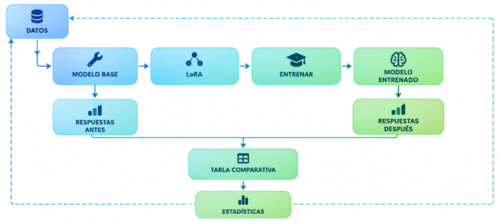
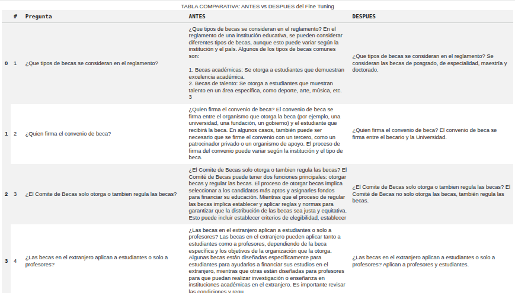

# Fine Tuning de Mistral-7B para Reglamento de Becas UAT

Entrenamiento de un modelo de lenguaje (Mistral-7B) para responder 
preguntas sobre el Reglamento de Becas de la UAT.

## Diagrama

## Uso

1. Abrir `Maestria-FT-Mistral-Presentacion.ipynb` en Colab
2. Configurar `HF_TOKEN` en Secrets
3. Ejecutar todas las celdas

## Tecnologías

- Mistral-7B (4-bit)
- LoRA (r=16)
- Unsloth + Transformers
- Google Colab

## Resultados

## Autor

Ricardo De Jesus Bernal Montalvo
